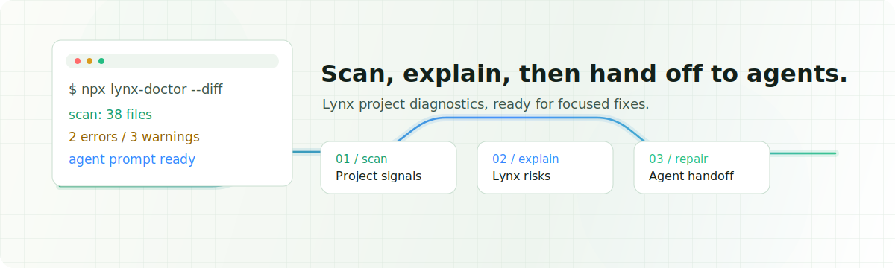

<h1 align="center">Lynx Doctor</h1>

<p align="center">
  Diagnose Lynx projects before agents fix them.
</p>

<p align="center">
  <a href="./README.zh-CN.md">中文</a>
  ·
  <a href="./CONTRIBUTING.md">Contributing</a>
  ·
  <a href="./website/docs/en/index.mdx">Docs</a>
  ·
  <a href="./examples">Examples</a>
</p>

<p align="center">
  <a href="https://nodejs.org/"></a>
  <a href="https://pnpm.io/"></a>
  <a href="./LICENSE"></a>
</p>

<p align="center">
  
</p>

Lynx Doctor is a deterministic scanner and agent handoff CLI for Lynx projects. It finds Lynx-specific risks, explains why they matter, and generates focused repair prompts for coding agents.

## Highlights

| Workflow | What Lynx Doctor gives you |
| --- | --- |
| Scan a project | A health score, grouped diagnostics, source locations, and fix guidance |
| Review changed files | `--diff` and `--staged` scans for pull request workflows |
| Hand off to agents | Focused prompts that describe the highest-priority issues and verification steps |
| Install in CI | A package script, GitHub Actions workflow, and agent notes |

## Why

Lynx projects have constraints that generic JavaScript linters do not understand:

- code can cross main-thread and background-thread boundaries
- some Lynx APIs are background-only
- `main-thread:` handlers need explicit directives
- Rspeedy and TypeScript configuration shape runtime behavior
- lazy bundles need safe loading boundaries

Lynx Doctor makes those constraints visible before an agent starts editing code.

## Quick Start

Run a scan from a Lynx project root:

```bash
npx lynx-doctor@latest
```

Scan only changed files:

```bash
npx lynx-doctor@latest --diff
```

Generate a repair prompt:

```bash
npx lynx-doctor@latest --diff --agent-prompt
```

Launch a local agent command directly:

```bash
npx lynx-doctor@latest --diff --agent codex
```

When diagnostics are found in an interactive terminal, Lynx Doctor also offers
an arrow-key agent selection prompt after the scan.

## What It Checks

| Area | Examples |
| --- | --- |
| reactlynx | thread boundaries, lifecycle behavior, main-thread handlers, `globalPropsMode`, lazy loading, and TypeScript setup |
| lynx-ui | public component imports, documented component APIs, and gesture configuration |
| rspeedy | bundle-size hazards such as export-star barrels and `eval()` |

List rules:

```bash
npx lynx-doctor@latest rules list
```

Explain one rule:

```bash
npx lynx-doctor@latest rules explain reactlynx/background-only-api
```

## CLI

```bash
lynx-doctor [directory] [options]
```

| Option | Description |
| --- | --- |
| `--verbose` | Show every diagnostic with source context, docs, and skill source |
| `--json` | Output a structured scan report |
| `--score` | Print only the numeric health score |
| `--diff [base]` | Scan files changed against a base ref |
| `--staged` | Scan only staged files |
| `--category <category>` | Show one category, repeatable: `reactlynx`, `lynx-ui`, or `rspeedy` |
| `--no-warnings` | Hide warning-severity diagnostics |
| `--blocking <level>` | Fail threshold: `error`, `warning`, or `none` |
| `--agent-prompt` | Print a focused agent repair prompt |
| `--agent <command>` | Pipe the repair prompt to a local agent command |
| `--no-agent-select` | Disable the interactive agent selection prompt |

Install CI and agent notes:

```bash
npx lynx-doctor@latest install
```

## Configuration

Create `lynx-doctor.config.ts`, `lynx-doctor.config.mjs`, or `lynx-doctor.config.json` in the project root.

```ts
import { defineConfig } from "lynx-doctor";

export default defineConfig({
  ignore: {
    files: ["src/generated/**"]
  },
  rules: {
    "reactlynx/lazy-without-suspense": "warning"
  },
  categories: {
    "lynx-ui": "off"
  },
  agent: {
    command: "codex"
  }
});
```

## Node API

```ts
import { buildAgentPrompt, formatReport, scanProject } from "lynx-doctor";

const report = await scanProject({
  directory: process.cwd(),
  diff: true,
  blocking: "warning"
});

console.log(formatReport(report, { verbose: true }));
console.log(buildAgentPrompt(report));
```

## Examples

The repository includes standalone Lynx projects under `examples/`.

| Project | Purpose |
| --- | --- |
| `examples/healthy-shop` | A clean project that should scan at `100/100` |
| `examples/threading-regressions` | Intentional `reactlynx` threading, lifecycle, and event errors |
| `examples/event-mode-settings` | `reactlynx` configuration and lazy-loading warnings |

See [CONTRIBUTING.md](./CONTRIBUTING.md) for local development, docs, and example validation.

## License

Apache License 2.0
