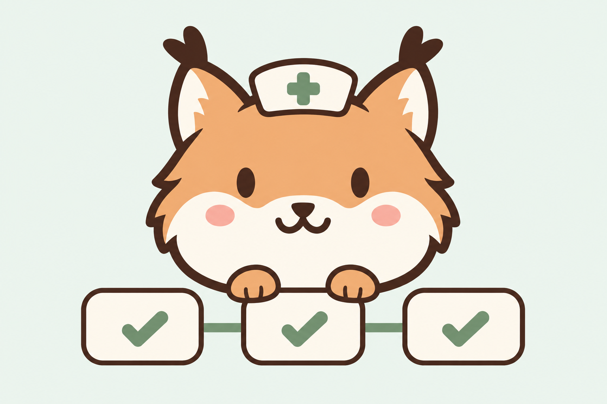

<p align="center">
  
</p>

<h1 align="center">Lynx Doctor</h1>

<p align="center">
  <strong>A health check for your Lynx project.</strong><br />
  Find threading, API, and build issues. Get fix suggestions and repair prompts for your agent.
</p>

<p align="center">
  <a href="https://lynx-community.github.io/lynx-doctor/">Documentation</a>
  ·
  <a href="https://lynx-community.github.io/lynx-doctor/guide/quickstart.html">Quickstart</a>
  ·
  <a href="./examples">Examples</a>
  ·
  <a href="./CONTRIBUTING.md">Contributing</a>
  ·
  <a href="./README.zh-CN.md">中文</a>
</p>

<p align="center">
  <a href="https://nodejs.org/"></a>
  <a href="./LICENSE"></a>
</p>

## Choose a workflow

<table width="100%">
  <tr>
    <td align="center" valign="top" width="33%">
      <a href="#quick-start"></a>
      <p><strong><a href="#quick-start">Check your code →</a></strong><br />Find issues and the exact lines to fix.</p>
    </td>
    <td align="center" valign="top" width="33%">
      <a href="#fix-with-an-agent"></a>
      <p><strong><a href="#fix-with-an-agent">Work with an agent →</a></strong><br />Turn the report into a repair prompt.</p>
    </td>
    <td align="center" valign="top" width="33%">
      <a href="#add-to-ci"></a>
      <p><strong><a href="#add-to-ci">Check pull requests →</a></strong><br />Run the checks in GitHub Actions.</p>
    </td>
  </tr>
</table>

## Quick Start

Requires **Node.js 22.12 or later**. Run a scan from your Lynx project root:

```bash
npx lynx-doctor@latest
```

Scan only changed files:

```bash
npx lynx-doctor@latest --diff
```

## Fix with an Agent

Generate a prompt with source locations, fix suggestions, and verification commands:

```bash
npx lynx-doctor@latest --diff --agent-prompt
```

If you have a local coding agent set up, pass the prompt to it directly:

```bash
npx lynx-doctor@latest --diff --agent codex
```

When a scan finds issues in an interactive terminal, you can also choose an agent from the menu. See the [agent guide](https://lynx-community.github.io/lynx-doctor/guide/agent-workflow.html) for details.

## Add to CI

Run this once in your project:

```bash
npx lynx-doctor@latest install
```

This adds a `doctor` script, a GitHub Actions workflow, and `.agents/lynx-doctor.md` with instructions for coding agents. The default workflow checks changed files on pull requests and fails on errors or warnings. See [CI setup](https://lynx-community.github.io/lynx-doctor/guide/ci.html) to adjust that behavior.

## What It Checks

| Area | Examples |
| --- | --- |
| `reactlynx` | Thread boundaries, lifecycle hooks, main-thread handlers, `globalPropsMode`, lazy loading, and TypeScript setup |
| `lynx-ui` | Component imports, supported props, and gesture configuration |
| `rspeedy` | Bundle-size risks such as re-exporting every module with `export *` and using `eval()` |

List rules:

```bash
npx lynx-doctor@latest rules list
```

Explain one rule:

```bash
npx lynx-doctor@latest rules explain reactlynx/background-only-api
```

<details>
<summary><strong>CLI options, configuration, and Node API</strong></summary>

### CLI options

```bash
lynx-doctor [directory] [options]
```

| Option | Description |
| --- | --- |
| `--verbose` | Show every diagnostic with source context, docs, and skill source |
| `--json` | Output a structured scan report |
| `--score` | Print only the numeric health score |
| `--diff [base]` | Scan files changed against a base ref |
| `--staged` | Scan only staged files |
| `--category <category>` | Show one category, repeatable: `reactlynx`, `lynx-ui`, or `rspeedy` |
| `--no-warnings` | Hide warning-severity diagnostics |
| `--blocking <level>` | Fail threshold: `error`, `warning`, or `none` |
| `--agent-prompt` | Print a focused agent repair prompt |
| `--agent <command>` | Pipe the repair prompt to a local agent command |
| `--no-agent-select` | Disable the interactive agent selection prompt |

See the [CLI reference](https://lynx-community.github.io/lynx-doctor/reference/cli.html) for command details.

### Configuration

Create `lynx-doctor.config.ts`, `lynx-doctor.config.mjs`, or `lynx-doctor.config.json` in the project root.

```ts
import { defineConfig } from "lynx-doctor";

export default defineConfig({
  ignore: {
    files: ["src/generated/**"]
  },
  rules: {
    "reactlynx/lazy-without-suspense": "warning"
  },
  categories: {
    "lynx-ui": "off"
  },
  agent: {
    command: "codex"
  }
});
```

### Node API

```ts
import { buildAgentPrompt, formatReport, scanProject } from "lynx-doctor";

const report = await scanProject({
  directory: process.cwd(),
  diff: true,
  blocking: "warning"
});

console.log(formatReport(report, { verbose: true }));
console.log(buildAgentPrompt(report));
```

</details>

## Examples

The repository includes standalone Lynx projects under `examples/`.

| Project | Purpose |
| --- | --- |
| [healthy-shop](./examples/healthy-shop) | A passing example with a score of `100/100` |
| [threading-regressions](./examples/threading-regressions) | Intentional threading, lifecycle, and event errors |
| [event-mode-settings](./examples/event-mode-settings) | Configuration and lazy-loading warnings |

See [CONTRIBUTING.md](./CONTRIBUTING.md) for local development, docs, and example validation.

## License

[Apache License 2.0](./LICENSE)
