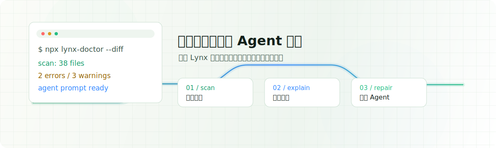

<h1 align="center">Lynx Doctor</h1>

<p align="center">
  先诊断，再让 Agent 修。
</p>

<p align="center">
  <a href="./README.md">English</a>
  ·
  <a href="./CONTRIBUTING.zh-CN.md">贡献指南</a>
  ·
  <a href="./website/docs/zh/index.mdx">中文文档</a>
  ·
  <a href="./examples">示例项目</a>
</p>

<p align="center">
  <a href="https://nodejs.org/"></a>
  <a href="https://pnpm.io/"></a>
  <a href="./LICENSE"></a>
</p>

<p align="center">
  
</p>

Lynx Doctor 是面向 Lynx 项目的确定性扫描器与 Agent 交接 CLI。它会扫描项目中的 Lynx 专属风险，解释问题原因，并生成可交给 coding agent 的聚焦修复提示。

## 亮点

| 工作流 | Lynx Doctor 提供什么 |
| --- | --- |
| 扫描项目 | 健康分数、分类诊断、源码位置和修复建议 |
| 检查改动 | 使用 `--diff` 和 `--staged` 支持 PR 场景 |
| 交给 Agent | 输出聚焦 prompt，说明高优先级问题和验证步骤 |
| 接入 CI | 生成 package script、GitHub Actions workflow 和 agent notes |

## 为什么需要它

Lynx 项目有很多通用 JavaScript linter 不理解的约束：

- 代码可能跨越主线程和后台线程边界
- 部分 Lynx API 只能在后台线程调用
- `main-thread:` handler 需要显式 directive
- Rspeedy 和 TypeScript 配置会影响运行时行为
- lazy bundle 需要安全的加载边界

Lynx Doctor 会在 Agent 开始改代码之前，把这些约束和风险先暴露出来。

## 快速开始

在 Lynx 项目根目录运行：

```bash
npx lynx-doctor@latest
```

只扫描当前改动：

```bash
npx lynx-doctor@latest --diff
```

生成修复 prompt：

```bash
npx lynx-doctor@latest --diff --agent-prompt
```

直接启动本地 Agent 命令：

```bash
npx lynx-doctor@latest --diff --agent codex
```

## 检查范围

| 分类 | 示例 |
| --- | --- |
| 线程边界 | 在非 background-only 上下文中调用 `lynx.getJSModule` 或 `NativeModules` |
| 生命周期 | ReactLynx 代码中使用 `useLayoutEffect` |
| 事件 | `main-thread:*` handler 缺少顶层 `"main thread"` directive |
| 配置 | 缺少 `@lynx-js/types`、`jsxImportSource` 不完整、`globalPropsMode: "event"` 下直接读取 global props |
| 性能 | 使用 `lazy()` 但缺少就近的 `Suspense` 边界 |

查看规则：

```bash
npx lynx-doctor@latest rules list
```

解释单条规则：

```bash
npx lynx-doctor@latest rules explain reactlynx/background-only-api
```

## CLI

```bash
lynx-doctor [directory] [options]
```

| 参数 | 说明 |
| --- | --- |
| `--verbose` | 展示每条诊断的源码上下文 |
| `--json` | 输出结构化扫描报告 |
| `--score` | 只输出数字健康分 |
| `--diff [base]` | 扫描相对 base 变化的文件 |
| `--staged` | 只扫描 staged 文件 |
| `--category <category>` | 只展示某个分类，可重复 |
| `--no-warnings` | 隐藏 warning 级别诊断 |
| `--blocking <level>` | 设置失败阈值：`error`、`warning` 或 `none` |
| `--agent-prompt` | 打印聚焦的 Agent 修复 prompt |
| `--agent <command>` | 把修复 prompt 传给本地 Agent 命令 |

安装 CI 和 agent notes：

```bash
npx lynx-doctor@latest install
```

## 配置

在项目根目录创建 `lynx-doctor.config.ts`、`lynx-doctor.config.mjs` 或 `lynx-doctor.config.json`。

```ts
import { defineConfig } from "lynx-doctor";

export default defineConfig({
  ignore: {
    files: ["src/generated/**"]
  },
  rules: {
    "reactlynx/lazy-without-suspense": "warning"
  },
  categories: {
    Performance: "off"
  },
  agent: {
    command: "codex"
  }
});
```

## Node API

```ts
import { buildAgentPrompt, formatReport, scanProject } from "lynx-doctor";

const report = await scanProject({
  directory: process.cwd(),
  diff: true,
  blocking: "warning"
});

console.log(formatReport(report, { verbose: true }));
console.log(buildAgentPrompt(report));
```

## 示例项目

仓库中的 `examples/` 目录包含几个独立的 Lynx 项目。

| 项目 | 用途 |
| --- | --- |
| `examples/healthy-shop` | 健康项目，预期扫描结果为 `100/100` |
| `examples/threading-regressions` | 故意包含 Threading、Lifecycle 和 Events 错误 |
| `examples/event-mode-settings` | 演示 Configuration 和 Performance warning |

本地开发、文档站和示例验证请参考 [CONTRIBUTING.zh-CN.md](./CONTRIBUTING.zh-CN.md)。

## 许可证

Apache License 2.0
